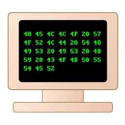
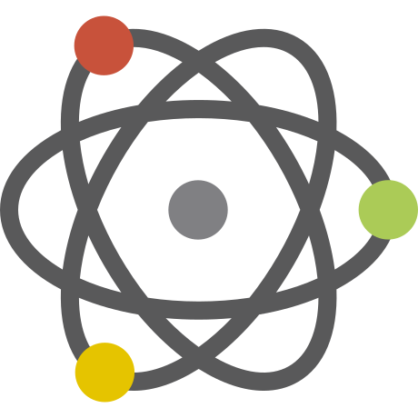

	 
	
	 

 

<table style="margin-left:auto; margin-right:auto; width: 90%;">
  <tr>
    <td>👨‍💻 Me</td>
    <td>I'm a data scientist, open-source software enthousiast and embedded tech hobbyist.</td>
  </tr>
  <tr>
    <td>👀 Talk to me about</td>
    <td>FOSS, Automation, Raspberry Pi, Arduino, Maths, Machine Learning, D3.js, Science, Philosophy, Gaming</td>
  </tr>
  <tr>
    <td>🛠️ Preferred tools</td>
    <td>GNU Linux, VSCodium</td>
  </tr>
  <tr>
    <td>🌱 I’m currently learning or reading about</td>
    <td>MCP, AI</td>
  </tr>
</table>

 

  

  

  

*Animated banner based on: https://github.com/sindresorhus/css-in-readme-like-wat*
